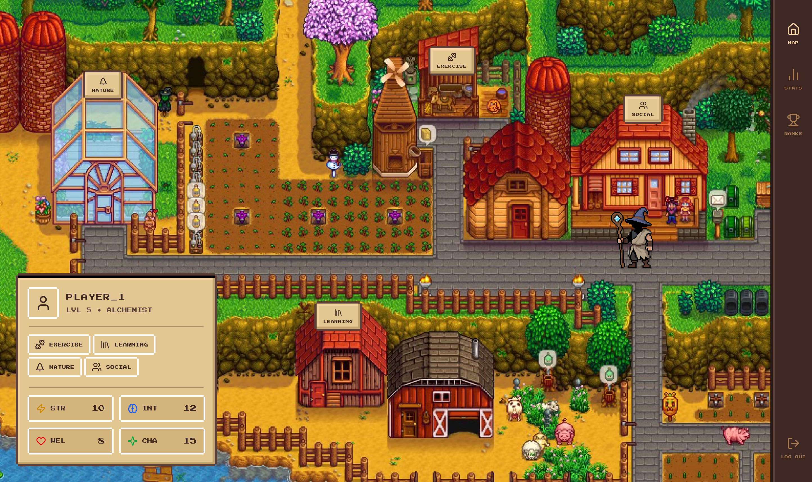
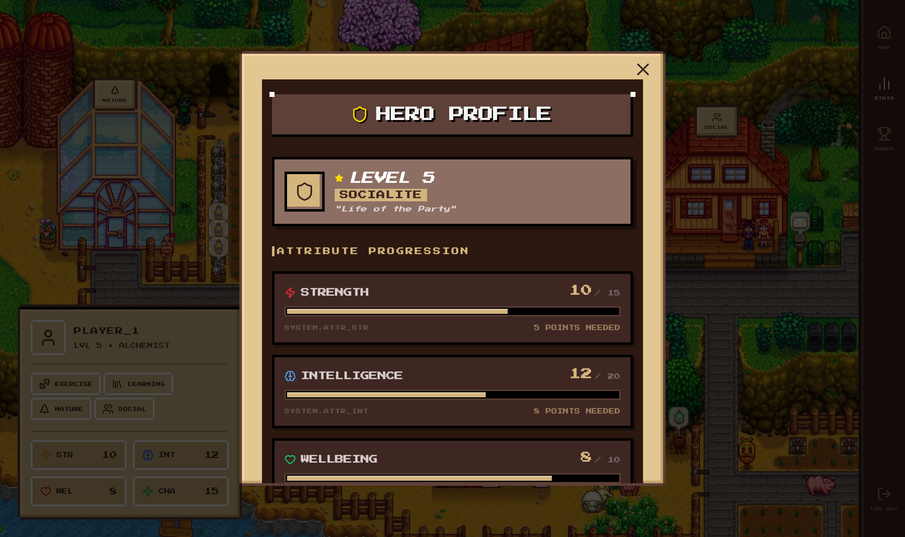
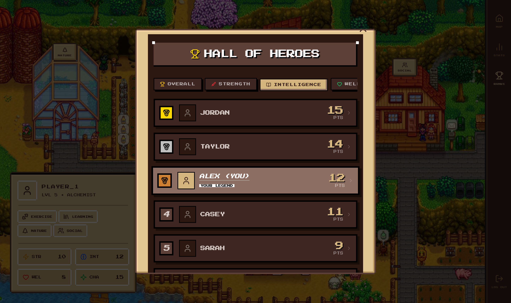
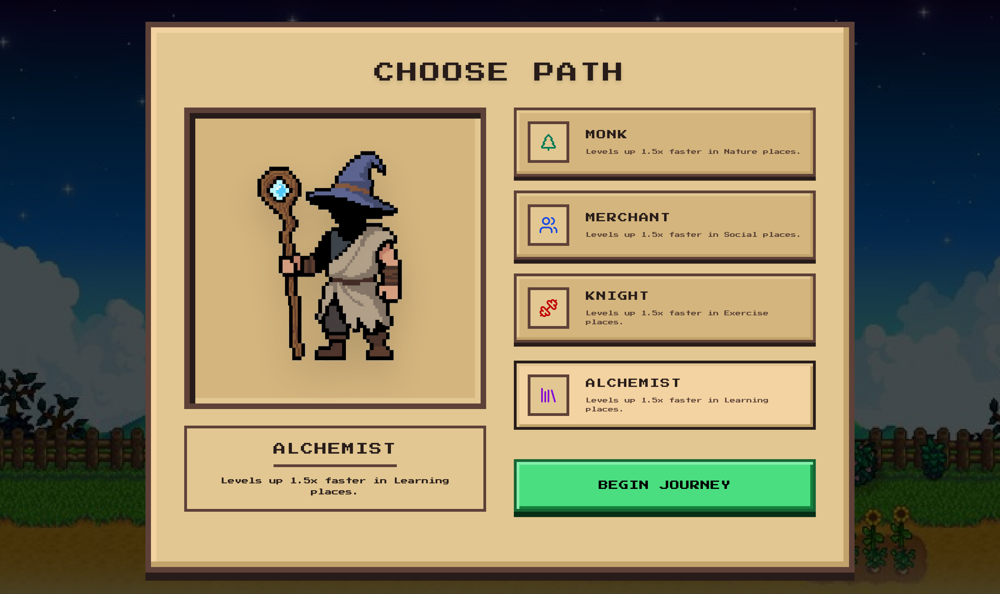
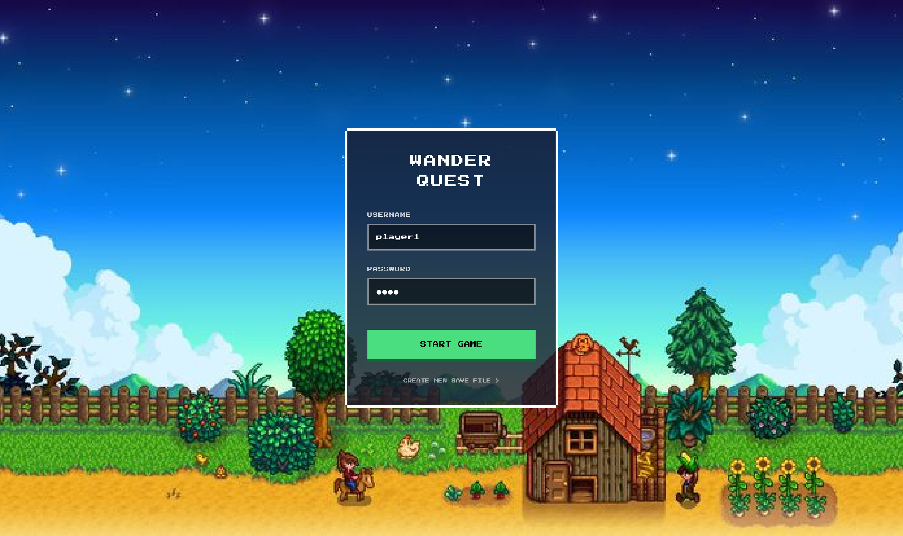

# Wander Quest
This was our winning submission to the Soton Datascience and WECS hackathon.
It's a gamified way of getting outside and being social, with pixel art inspired by stardew valley.

We used react and tailwind css for the frontend, with a backend in python using FastAPI.

## App Preview
The user's real world geolocation is categorised into one of four categories:
- Social (cafes, shopping, etc.)
- Nature (parks, open spaces)
- Exercise (gyms, sports facilities)
- Learning (libraries, education facilities)

When the user is at a "social" location the main screen of the app is as shown here, with the user's sprite at the house on the right:



There are stats in each category that can be used to "level up", which are shown here:



Users can compete with their friends in different categories, or overall:



Users can log in or register, and choose their path. Their path allows them to gain more points for certain activities, e.g. the knight earns more points from exercising.






## Setup and Running It Yourself

### Project Setup

For the location categorisation, you must obtain an api key from [https://www.mapbox.com/](mapbox).

Then create a python file in `backend/controllers/` called `mapbox_token.py` with your token:

``` backend/controllers/mapbox_token.py
TOKEN = "{Paste your token here}"
```


To set up the backend:
1. `cd backend`
2. `uv sync`

To set up the frontend:
1. `cd frontend`
2. `npm install`

### Running the App
You need 2 terminals, one for the fastapi server and one for the frontend.

1. Backend terminal (from project root directory):
  ```uv run --project backend uvicorn backend.main:app --reload```

2. Frontend terminal (from `frontend` directory):
  ```npm run dev```

3. Go to [localhost port 5173](http://localhost:5173/) on a browser to see the web app
